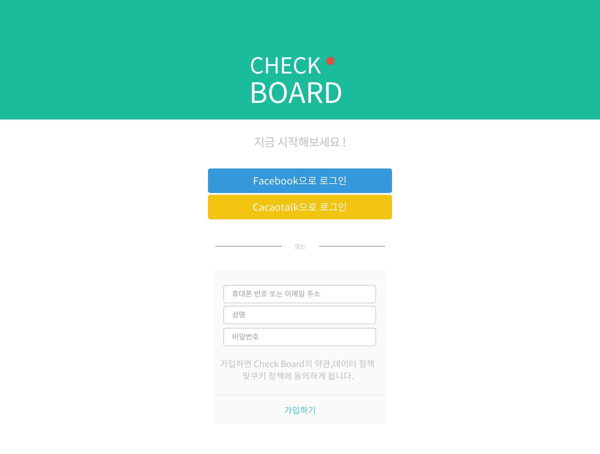
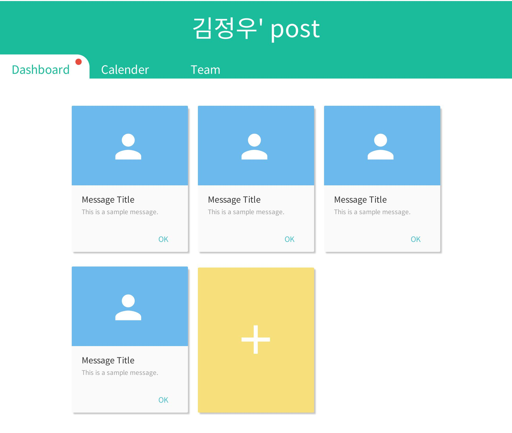
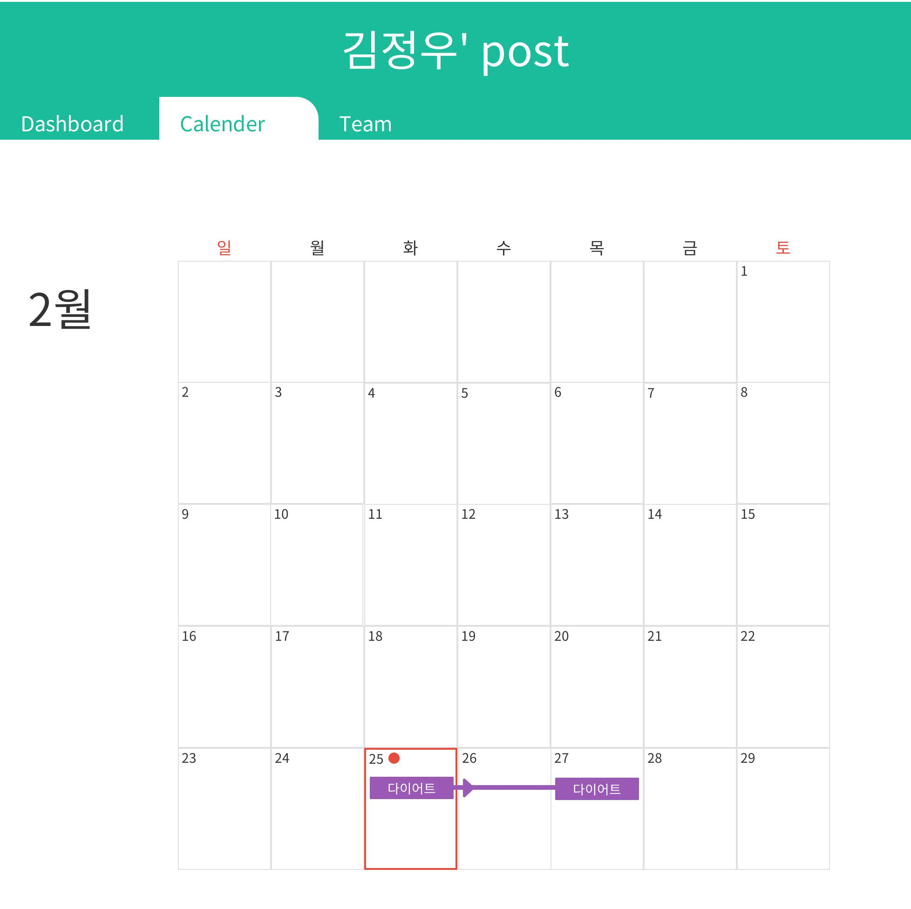
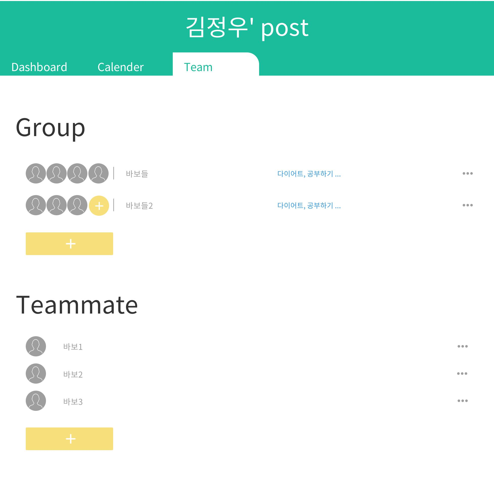
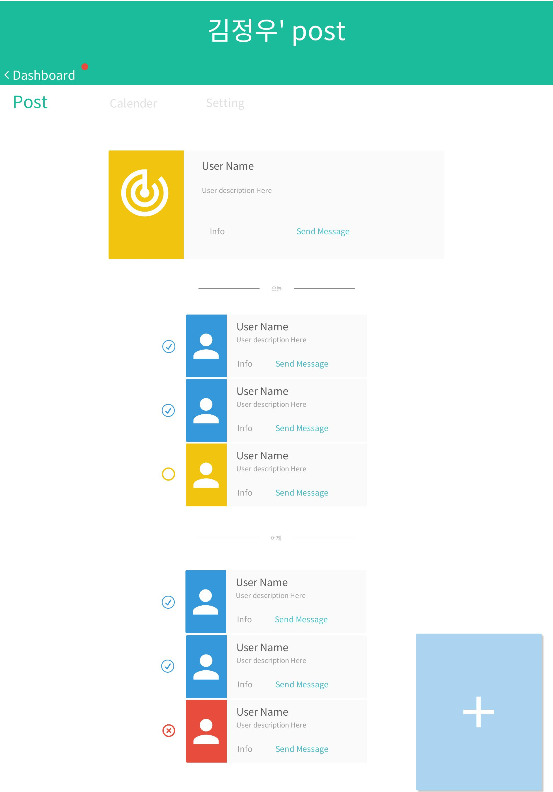

> 목차
### 기획
- [디자인스케치](#)
- [기능명세서](#)
- [개발환경](#)

### 회원 관련 기능
- [데이터베이스](#)
- [로그인 기능](#)
- [로그아웃 기능](#)
- ~~비밀번호 찾기 기능~~
- [로그인 여부 체크 기능](#)
  - [필터](#)
  - [커스텀 태그](#)

### 체크보드 관련 기능
- [데이터베이스](#)
- [체크보드 등록](#)
- [체크보드 내용 출력하기](#)
  - [참여자 출력하기](#)
  - [참여자 응답 출력하기](#)
  - [결과 보여주기](#)
  - [로그남기기](#)
- [체크보드 삭제](#)
- [체크보드 수정](#)

### 게시글 관련 기능
- [데이터베이스](#)
- [게시글 등록](#)
- [게시글 삭제](#)
- [게시글 조회](#)
- [게시글 수정](#)
- [답글 달기](#)

  
  

## 기획
### 디자인스케치

